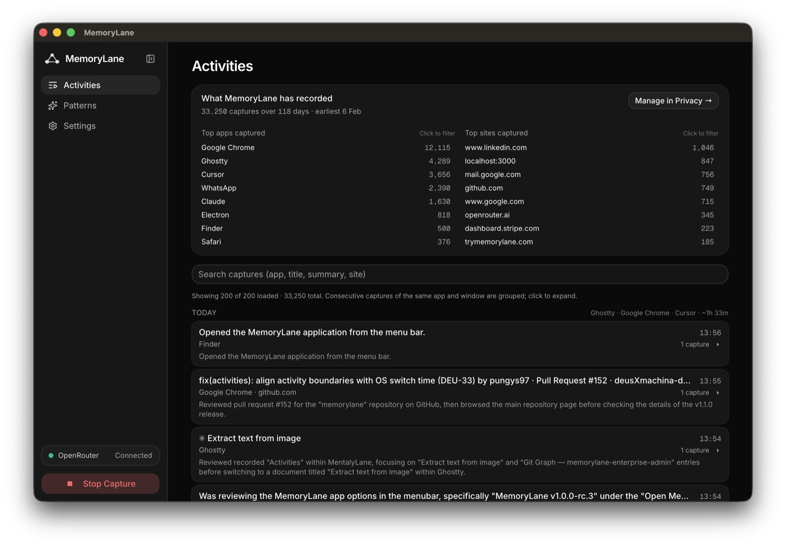

# MemoryLane

## App Download

## What is MemoryLane?

MemoryLane is a tray app for macOS and Windows that captures your screen as you work, summarizes each capture into text through your model endpoint, then deletes the screenshot. Only the summaries, OCR text, and embeddings are kept — in a local SQLite database with full-text and vector search. From there it detects recurring workflows, surfaces automation opportunities, and makes everything queryable from any AI chat over MCP.

**Capture → summarize → store locally → detect patterns → query from any AI chat via MCP**

  

🎬 [Demo](https://www.youtube.com/watch?v=MU7S3FHHlr8)

## Use your own models

By default, captures are summarized through a managed [OpenRouter](https://openrouter.ai/) endpoint. You can instead point MemoryLane at your own LLM — a local model via Ollama, vLLM, or LM Studio, or your own OpenRouter account — all from Settings, no rebuild. With a local endpoint, captures never leave your machine. See [Using Your Own Models](docs/CUSTOM_SETUP.md).

## Privacy & Permissions

See [Privacy & Permissions](docs/privacy-and-permissions.md).

## CLI

Install the CLI from npm: [`@deusxmachina-dev/memorylane-cli`](https://www.npmjs.com/package/@deusxmachina-dev/memorylane-cli)

## Community

Questions, feedback, and feature ideas are welcome in our Discord server.

[Join the MemoryLane Discord](https://discord.gg/AHmURhKXdP)
